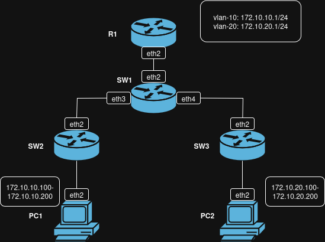

# Лабораторная работа №1

## Задание

<https://itmo-ict-faculty.github.io/introduction-in-routing/education/labs2023_2024/lab1/lab1/>


### Топология

```
name: lab_1

topology:
  nodes:
    R1:
      kind: vr-mikrotik_ros
      image: vrnetlab/mikrotik_routeros:6.47.9
      mgmt-ipv4: 172.10.0.11
      startup-config: ./configs/R1.rsc
    SW1:
      kind: vr-mikrotik_ros
      image: vrnetlab/mikrotik_routeros:6.47.9
      mgmt-ipv4: 172.10.0.12
      startup-config: ./configs/SW1.rsc
    SW2:
      kind: vr-mikrotik_ros
      image: vrnetlab/mikrotik_routeros:6.47.9
      mgmt-ipv4: 172.10.0.13
      startup-config: ./configs/SW2.rsc
    SW3:
      kind: vr-mikrotik_ros
      image: vrnetlab/mikrotik_routeros:6.47.9
      mgmt-ipv4: 172.10.0.14
      startup-config: ./configs/SW3.rsc
    PC1:
      kind: linux
      image: alpine:latest
      binds:
        - ./configs:/configs
      exec:
        - sh /configs/PC1.sh
    PC2:
      kind: linux
      image: alpine:latest
      binds:
        - ./configs:/configs
      exec:
        - sh /configs/PC2.sh

  links:
    - endpoints: ["R1:eth2", "SW1:eth2"]
    - endpoints: ["SW1:eth3", "SW2:eth2"]
    - endpoints: ["SW1:eth4", "SW3:eth2"]
    - endpoints: ["SW2:eth3", "PC1:eth2"]
    - endpoints: ["SW3:eth3", "PC2:eth2"]

mgmt:
  network: lab-1
  ipv4-subnet: 172.10.0.0/24

```

Ниже представлена схема сети в draw.io:




### Настройка маршрутизатора R1

Этот набор команд настраивает MikroTik RouterOS для создания сети с двумя VLAN, DHCP-серверами, а также содержит настройку админа и имени устройства:
```
/interface vlan
add name=vlan10 vlan-id=10 interface=ether3
add name=vlan20 vlan-id=20 interface=ether3
/ip address
add address=172.10.10.1/24 interface=vlan10
add address=172.10.20.1/24 interface=vlan20
/ip pool
add name=dhcp_pool_vlan10 ranges=172.10.10.100-172.10.10.200
add name=dhcp_pool_vlan20 ranges=172.10.20.100-172.10.20.200
/ip dhcp-server
add name=dhcp_vlan10 interface=vlan10 address-pool=dhcp_pool_vlan10 disabled=no
add name=dhcp_vlan20 interface=vlan20 address-pool=dhcp_pool_vlan20 disabled=no
/ip dhcp-server network
add address=172.10.10.0/24 gateway=172.10.10.1
add address=172.10.20.0/24 gateway=172.10.20.1
/user add name=paninanq password=paninanq group=full
/system identity set name=R1
```


### Настройка коммутатора SW1

Этими командами настраивается коммутатор MikroTik (SW1) для создания двух изолированных VLAN (10 и 20), объединяющих порты ether3, ether4 и ether5 в мосты:
```
/interface vlan
add name=vlan10_ether3 vlan-id=10 interface=ether3
add name=vlan20_ether3 vlan-id=20 interface=ether3
add name=vlan10_ether4 vlan-id=10 interface=ether4
add name=vlan20_ether5 vlan-id=20 interface=ether5
/interface bridge
add name=bridge_vlan10
add name=bridge_vlan20
/interface bridge port
add interface=vlan10_ether3 bridge=bridge_vlan10
add interface=vlan10_ether4 bridge=bridge_vlan10
add interface=vlan20_ether3 bridge=bridge_vlan20
add interface=vlan20_ether5 bridge=bridge_vlan20
/ip dhcp-client
add disabled=no interface=bridge_vlan20
add disabled=no interface=bridge_vlan10
/user add name=paninanq password=paninanq group=full
/system identity set name=SW1
```

### Настройка SW2 и SW3
Этими командами настраивается коммутатор MikroTik (SW2 и SW3 аналогичны) для создания VLAN на портах, объединения их в мост с автоматическим получением IP-адреса через DHCP:

```
/interface vlan
add name=vlan10_ether3 vlan-id=10 interface=ether3
add name=vlan10_ether4 vlan-id=10 interface=ether4
/interface bridge
add name=bridge_vlan10
/interface bridge port
add interface=vlan10_ether3 bridge=bridge_vlan10
add interface=vlan10_ether4 bridge=bridge_vlan10
/ip dhcp-client
add disabled=no interface=bridge_vlan10
/user add name=paninanq password=paninanq group=full
/system identity set name=SW2
```

### Настройка ПК

Командами ниже настраиваются два компьютера (PC1 и PC2) для подключения к разным VLAN (10 и 20) через интерфейс eth2, с автоматическим получением IP-адресов и добавлением статических маршрутов для взаимной связи между подсетями.

PC1:
```
#!/bin/sh
ip link add link eth2 name vlan10 type vlan id 10
ip addr add 172.10.10.10/24 dev vlan10
ip link set vlan10 up
udhcpc -i vlan10
ip route add 172.10.20.0/24 via 172.10.10.1 dev vlan10
```
PC2:
```
#!/bin/sh
ip link add link eth2 name vlan20 type vlan id 20
ip addr add 172.10.20.10/24 dev vlan20
ip link set vlan20 up
udhcpc -i vlan20
ip route add 172.10.10.0/24 via 172.10.20.1 dev vlan20
```

### Результат работы

При деплое сети получаем:

`containerlab deploy`

```
containerlab deploy
21:45:01 INFO Containerlab started version=0.70.2
21:45:01 INFO Parsing & checking topology file=lab-1.clab.yaml
21:45:01 INFO Creating docker network name=lab-1 IPv4 subnet=172.10.0.0/24 IPv6 subnet="" MTU=0
21:45:01 INFO Creating lab directory path=/home/paninanq/sem-5/lab_1/clab-lab_1
21:45:01 INFO Creating container name=SW3
21:45:01 INFO Creating container name=SW2
21:45:01 INFO Creating container name=SW1
21:45:01 INFO Creating container name=R1
21:45:02 INFO Created link: R1:eth2 ▪┄┄▪ SW1:eth2
21:45:02 INFO Creating container name=PC2
21:45:02 INFO Creating container name=PC1
21:45:02 INFO Created link: SW1:eth4 ▪┄┄▪ SW3:eth2
21:45:02 INFO Created link: SW1:eth3 ▪┄┄▪ SW2:eth2
21:45:02 INFO Created link: SW3:eth3 ▪┄┄▪ PC2:eth2
21:45:02 INFO Created link: SW2:eth3 ▪┄┄▪ PC1:eth2
21:46:13 INFO Executed command node=PC2 command="sh /configs/PC2.sh" stdout=""
21:46:13 INFO Executed command node=PC1 command="sh /configs/PC1.sh" stdout=""
21:46:13 INFO Adding host entries path=/etc/hosts
21:46:13 INFO Adding SSH config for nodes path=/etc/ssh/ssh_config.d/clab-lab_1.conf
You are on the latest version (0.70.2)
╭────────────────┬───────────────────────────────────┬───────────┬────────────────╮
│      Name      │             Kind/Image            │   State   │ IPv4/6 Address │
├────────────────┼───────────────────────────────────┼───────────┼────────────────┤
│ clab-lab_1-PC1 │ linux                             │ running   │ 172.10.0.3     │
│                │ alpine:latest                     │           │ N/A            │
├────────────────┼───────────────────────────────────┼───────────┼────────────────┤
│ clab-lab_1-PC2 │ linux                             │ running   │ 172.10.0.2     │
│                │ alpine:latest                     │           │ N/A            │
├────────────────┼───────────────────────────────────┼───────────┼────────────────┤
│ clab-lab_1-R1  │ vr-mikrotik_ros                   │ running   │ 172.10.0.11    │
│                │ vrnetlab/mikrotik_routeros:6.47.9 │ (healthy) │ N/A            │
├────────────────┼───────────────────────────────────┼───────────┼────────────────┤
│ clab-lab_1-SW1 │ vr-mikrotik_ros                   │ running   │ 172.10.0.12    │
│                │ vrnetlab/mikrotik_routeros:6.47.9 │ (healthy) │ N/A            │
├────────────────┼───────────────────────────────────┼───────────┼────────────────┤
│ clab-lab_1-SW2 │ vr-mikrotik_ros                   │ running   │ 172.10.0.13    │
│                │ vrnetlab/mikrotik_routeros:6.47.9 │ (healthy) │ N/A            │
├────────────────┼───────────────────────────────────┼───────────┼────────────────┤
│ clab-lab_1-SW3 │ vr-mikrotik_ros                   │ running   │ 172.10.0.14    │
│                │ vrnetlab/mikrotik_routeros:6.47.9 │ (healthy) │ N/A            │
╰────────────────┴───────────────────────────────────┴───────────┴────────────────╯

```

Ниже представлены доказательства того, что компьютеры получили ip адреса с помощью dhcp в правильных вланах и между ними есть связь.

```
docker exec -it clab-lab_1-PC1  sh
/ # ip a
1: lo: <LOOPBACK,UP,LOWER_UP> mtu 65536 qdisc noqueue state UNKNOWN qlen 1000
    link/loopback 00:00:00:00:00:00 brd 00:00:00:00:00:00
    inet 127.0.0.1/8 scope host lo
       valid_lft forever preferred_lft forever
    inet6 ::1/128 scope host 
       valid_lft forever preferred_lft forever
2: eth0@if47: <BROADCAST,MULTICAST,UP,LOWER_UP,M-DOWN> mtu 1500 qdisc noqueue state UP 
    link/ether 56:38:26:15:6f:6c brd ff:ff:ff:ff:ff:ff
    inet 172.10.0.2/24 brd 172.10.0.255 scope global eth0
       valid_lft forever preferred_lft forever
3: vlan10@eth2: <BROADCAST,MULTICAST,UP,LOWER_UP> mtu 9500 qdisc noqueue state UP qlen 1000
    link/ether aa:c1:ab:d3:6f:5b brd ff:ff:ff:ff:ff:ff
    inet 172.10.10.199/24 scope global vlan10
       valid_lft forever preferred_lft forever
    inet6 fe80::a8c1:abff:fed3:6f5b/64 scope link 
       valid_lft forever preferred_lft forever
45: eth2@if46: <BROADCAST,MULTICAST,UP,LOWER_UP,M-DOWN> mtu 9500 qdisc noqueue state UP 
    link/ether aa:c1:ab:d3:6f:5b brd ff:ff:ff:ff:ff:ff
    inet6 fe80::a8c1:abff:fed3:6f5b/64 scope link 
       valid_lft forever preferred_lft forever
/ # exit
paninanq@paninanq-BOM-WXX9:~/sem-5/lab_1$ docker exec -it clab-lab_1-PC2  sh
/ # ip a
1: lo: <LOOPBACK,UP,LOWER_UP> mtu 65536 qdisc noqueue state UNKNOWN qlen 1000
    link/loopback 00:00:00:00:00:00 brd 00:00:00:00:00:00
    inet 127.0.0.1/8 scope host lo
       valid_lft forever preferred_lft forever
    inet6 ::1/128 scope host 
       valid_lft forever preferred_lft forever
2: eth0@if48: <BROADCAST,MULTICAST,UP,LOWER_UP,M-DOWN> mtu 1500 qdisc noqueue state UP 
    link/ether da:66:09:7e:f7:8a brd ff:ff:ff:ff:ff:ff
    inet 172.10.0.3/24 brd 172.10.0.255 scope global eth0
       valid_lft forever preferred_lft forever
3: vlan20@eth2: <BROADCAST,MULTICAST,UP,LOWER_UP> mtu 9500 qdisc noqueue state UP qlen 1000
    link/ether aa:c1:ab:8c:38:6b brd ff:ff:ff:ff:ff:ff
    inet 172.10.20.199/24 scope global vlan20
       valid_lft forever preferred_lft forever
    inet6 fe80::a8c1:abff:fe8c:386b/64 scope link 
       valid_lft forever preferred_lft forever
41: eth2@if42: <BROADCAST,MULTICAST,UP,LOWER_UP,M-DOWN> mtu 9500 qdisc noqueue state UP 
    link/ether aa:c1:ab:8c:38:6b brd ff:ff:ff:ff:ff:ff
    inet6 fe80::a8c1:abff:fe8c:386b/64 scope link 
       valid_lft forever preferred_lft forever
/ # ping 172.10.10.199
PING 172.10.10.199 (172.10.10.199): 56 data bytes
64 bytes from 172.10.10.199: seq=0 ttl=63 time=1.987 ms
64 bytes from 172.10.10.199: seq=1 ttl=63 time=2.381 ms
64 bytes from 172.10.10.199: seq=2 ttl=63 time=2.529 ms
64 bytes from 172.10.10.199: seq=3 ttl=63 time=2.170 ms
64 bytes from 172.10.10.199: seq=4 ttl=63 time=2.249 ms
^C
--- 172.10.10.199 ping statistics ---
5 packets transmitted, 5 packets received, 0% packet loss
round-trip min/avg/max = 1.987/2.263/2.529 ms
/ # exit
```

## Заключение
В результате выполнения лабораторной работы была настроена трехуровневая сеть связи классического предприятияс VLAN-ами и DHCP-серверами. 